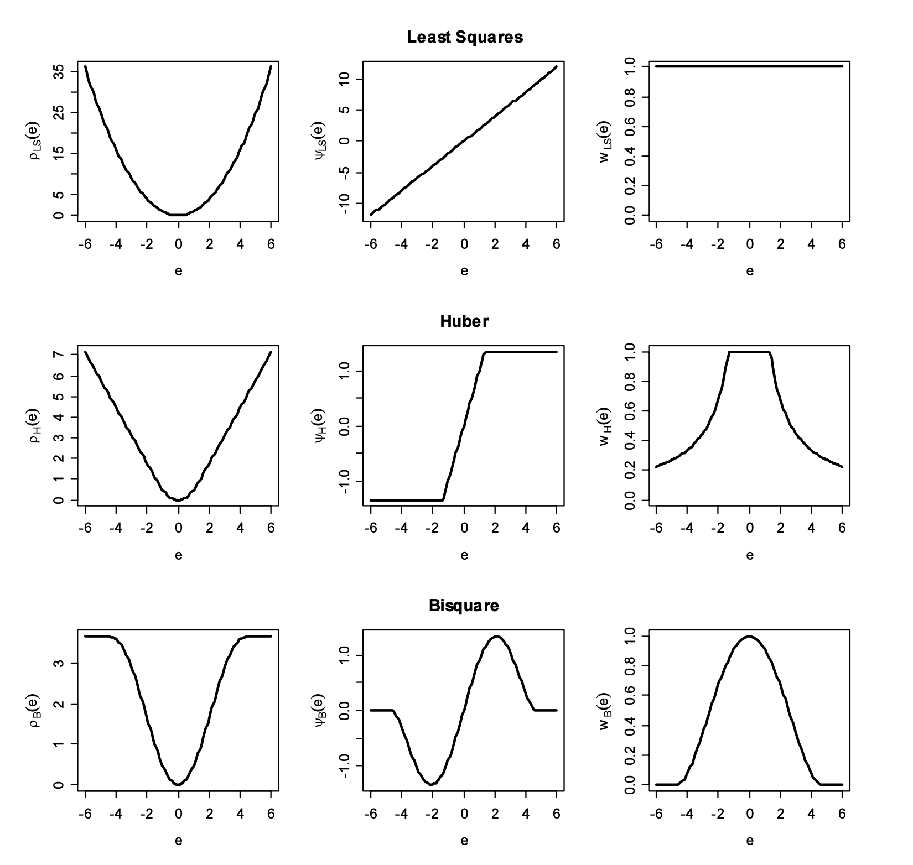

```{r setup, include=FALSE}
knitr::opts_chunk$set(echo = F, warning = F, message = F)

packages <- c('tidyverse','ggplot2', 'gridExtra','WRS2','ggfortify', 'knitr','car','kableExtra','pROC','ResourceSelection','MASS')
install.packages(setdiff(packages, rownames(installed.packages())))

library(tidyverse)
library(kableExtra)
library(ggplot2)
library(gridExtra)
library(knitr)
library(MASS)
library(WRS2)
library(ggfortify)
library(car)
library(pROC)
library(ResourceSelection)
```

# Introduction

The aviation industry is one of the most critical transportation sectors, providing fast and convenient means of travel for people and goods. On-time performance of flights is a critical aspect of the aviation industry that affects the satisfaction of customers and the reputation of the airlines. The aim of this project is to estimate the delays of flights between RDU (Raleigh-Durham International Airport) and MIA (Miami International Airport) using carrier on-time performance data from the Bureau of Transportation Statistics and weather data from NCDC NOAA datasets.

The rationale behind this project is to provide insights into the factors that contribute to flight delays and to develop a model that can predict the delay of flights. This information can be useful for both airlines to plan their operations and for customers to make informed decisions about their travel plans.

## Study Aims

### Aim 1 {#aim-1}

1)  To develop a model that predicts the delay of flights between RDU and MIA based on historical carrier performance, scheduled departure time, and weather conditions.

### Aim 2 {#aim-2}

2)  To identify the factors that contribute to flight cancellations, such as weather conditions or specific seasonal trends.

## Primary Hypotheses

The primary hypothesis is that harsh weather conditions typically result in longer delay times and cancellations for flights between RDU and MIA.

## Secondary Hypotheses

The secondary hypotheses are that the relationship between flight delay time / cancellation and weather condition may vary depending on:

-   Departure time of day (e.g. early morning vs. night time)
-   Flight date (hinting towards seasonality effects)
-   Airline-specific factors

# Detailed Data and Study Description

## Primary Outcome

```{r}
# CANCELLATION CODES
# A-Carrier Caused
# B-Weather
# C-National Aviation System
# D-Security

data.frame(
  "Outcome" = c(
    "Departure Delay",
    "Cancellation Code"
    ),
  "Description" = c(
    "Departure delay (minutes),\ndefined as actual departure time - CRS (Computer Reservation System) departure time",
    "Cancellation codes used by the Bureau of Transportation Statistics (BTS)"
    ),
  "name" = c(
    "DEP_DELAY (carrier.csv)",
    "CANCELLATION_CODE (carrier.csv)"
    ),
  "Specifications" = c(
    "Minutes (continuous and can be negative)",
    "A=Carrier Caused, B=Weather, C=National Aviation System, D=Security")
) %>%
  rename("Variable Name and Source" = name) %>%
  kbl(booktabs = T, linesep = '\\addlinespace \\addlinespace \\addlinespace',
      caption = "Primary Outcomes") %>%
  column_spec(2, width = "5cm") %>%
  column_spec(1, width = "2cm") %>%
  column_spec(4, width = "3cm") %>%
  row_spec(0, bold=TRUE) %>%
  kable_styling(latex_options = c("scale_down", "HOLD_position"))
```

## Additional Variables of Interest

```{r}
data.frame(
  "Variable" = c(
    "Unique Carrier Code",
    "Scheduled Departure Time",
    "Average Wind Speed",
    "Precipitation",
    "Average Temperature",
    "Maximum Temperature",
    "Minimum Temperature",
    "Direction of fastest 2-minute wind",
    "Direction of fastest 5-minute wind",
    "Fastest 2-minute wind speed",
    "Fastest 5-minute wind speed"
    ),
  "Description" = c(
    "Unique carrier code used to identify airlines",
    "CRS (Computer Reservation System) departure time",
    "Average daily wind speed (miles per hour)",
    "Precipitation (inches)",
    "Average temperature (degrees Fahrenheit)",
    "Maximum temperature (degrees Fahrenheit)",
    "Minimum temperature (degrees Fahrenheit)",
    "Direction of fastest 2-minute wind (degrees)",
    "Direction of fastest 5-minute wind (degrees)",
    "Fastest 2-minute wind speed (miles per hour)",
    "Fastest 5-minute wind speed (miles per hour)"
    ),
  "name" = c(
    "OP_UNIQUE_CARRIER (carrier.csv)",
    "CRS_DEP_TIME (carrier.csv)",
    "AWND.<origin or dest> * (weather.csv)",
    "PRCP.<origin or dest> * (weather.csv)",
    "TAVG.<origin or dest> * (weather.csv)",
    "TMAX.<origin or dest> * (weather.csv)",
    "TMIN.<origin or dest> * (weather.csv)",
    "WDF2.<origin or dest> * (weather.csv)",
    "WDF5.<origin or dest> * (weather.csv)",
    "WSF2.<origin or dest> * (weather.csv)",
    "WSF5.<origin or dest> * (weather.csv)"
    ),
  "Specifications" = c(
    "Character",
    "Military time (integer from 0 (midnight) to 2359 (11:59pm))",
    "Miles per hour (double)",
    "Inches (double)",
    "Degrees Fahrenheit (integer)",
    "Degrees Fahrenheit (integer)",
    "Degrees Fahrenheit (integer)",
    "Degrees (integer from 10 to 360 in intervals of 10)",
    "Degrees (integer from 10 to 360 in intervals of 10)",
    "Miles per hour (double)",
    "Miles per hour (double)"
    )
) %>%
  rename("Variable Name and Source" = name) %>%
  kbl(booktabs = T, linesep = "\\addlinespace",
      caption = "Additional Variables of Interest") %>%
  column_spec(4, width = "4cm") %>%
  column_spec(3, width = "5cm") %>%
  column_spec(1, width = "3cm") %>%
  row_spec(0, bold=TRUE) %>%
  kable_styling(latex_options = c("striped", "scale_down", "HOLD_position")) %>%
  add_footnote("\n *Data is available for both origin and destination locations on the same day (e.g. TMAX.origin and TMAX.dest)", notation = "none", escape = F)

```

The complete variable encoding documentation for **weather** data can be found [here](https://www.ncei.noaa.gov/pub/data/cdo/documentation/GHCND_documentation.pdf). Similarly, the complete variable encoding documentation for **carrier** data can be found [here](https://www.transtats.bts.gov/TableInfo.asp?gnoyr_VQ=FGJ&QO_fu146_anzr=b0-gvzr&V0s1_b0yB=D).

## Inclusion Criteria

Flight data was downloaded on a monthly basis from January 2021 to November 2022 for the state of North Carolina only (includes arrival and departure data).

## Exclusion Criteria

The time frame was chosen to gather enough data for statistical significance, but at the same time limiting confounding variables around pre-covid commercial flying patterns. Thus, earlier year data (1987-2019) is still available, but not considered for this analysis.

## Study Design

This is an observational study of commercial flights. Each data point represents a flight at a specified date and time, and attached are core weather statistics for the flight day at both origin and destination airports. All available flights between RDU and MIA were selected, but weather information is less reliable due to potential instrumental/human errors, as well as accessibility to certain data points.

# Methods

```{r importData}
#Documentation: https://www.ncei.noaa.gov/pub/data/cdo/documentation/GHCND_documentation.pdf

weather <- read.csv("../RawData/weather.csv")

carrier <- read.csv("../RawData/T_ONTIME_REPORTING.csv") %>%
    filter((ORIGIN == "RDU" & DEST == "MIA") | (ORIGIN == "MIA" & DEST == "RDU"))

for (i in 2:24) {
  carrier_i <- read.csv(paste0("../RawData/T_ONTIME_REPORTING ", i,".csv")) %>%
    filter((ORIGIN == "RDU" & DEST == "MIA") | (ORIGIN == "MIA" & DEST == "RDU"))
  carrier <- rbind(carrier, carrier_i)
}

# https://www.ncdc.noaa.gov/cdo-web/datasets/GHCND/stations/GHCND:USW00012839/detail
weather$STATION[weather$STATION == "USW00012839"] <- "MIA"

# https://www.ncdc.noaa.gov/cdo-web/datasets/GHCND/stations/GHCND:USW00013722/detail
weather$STATION[weather$STATION == "USW00013722"] <- "RDU"

weather_mia_rdu <- weather %>%
  filter(STATION %in% c("MIA", "RDU")) %>%
  mutate(DATE = as.Date(DATE))

carrier <- carrier %>%
  mutate(FL_DATE = as.Date(FL_DATE, "%m/%d/%Y"))

df <- left_join(carrier, weather_mia_rdu, by = c("ORIGIN" = "STATION", "FL_DATE" = "DATE"))
df <- left_join(df, weather_mia_rdu, by = c("DEST" = "STATION", "FL_DATE" = "DATE"))

df <- df %>%
  select_all(~gsub(".x", ".origin", .)) %>%
  select_all(~gsub(".y", ".dest", .))

df <- df %>%
  dplyr::select(-c(DEP_TIME, TAXI_OUT, WHEELS_OFF, WHEELS_ON, TAXI_IN, CRS_ARR_TIME, ARR_TIME, ARR_DELAY, CRS_ELAPSED_TIME, ACTUAL_ELAPSED_TIME, CARRIER_DELAY, WEATHER_DELAY, NAS_DELAY, SECURITY_DELAY, LATE_AIRCRAFT_DELAY, CANCELLED))

```

```{r include=FALSE}
df_num <- df %>%
  dplyr::select_if(is.numeric) %>%
  dplyr::select(!contains("dest"))

df_summ <- data.frame(min = sapply(df_num, min, na.rm = TRUE),
                      first_quartile = sapply(df_num, function(x) quantile(x, probs = 0.25, na.rm = TRUE)),
                      median = sapply(df_num, median, na.rm = TRUE),
                      mean = sapply(df_num, mean, na.rm = TRUE),
                      third_quartile = sapply(df_num, function(x) quantile(x, probs = 0.75, na.rm = TRUE)),
                      max = sapply(df_num, max, na.rm = TRUE),
                      percent_NA = sapply(df_num, function(x) sum(is.na(x))/length(x)*100))

na_cols_plot <- df_summ %>%
  ggplot(aes(x = percent_NA)) +
  geom_histogram() +
  xlab("NA Percentage (%)") + 
  ylab("Num. of Columns") +
  theme(axis.title = element_text(size=16),
        axis.text = element_text(size=12))

png("na_cols_plot.png")
na_cols_plot
dev.off()
```

## Data Cleaning and Processing

The carrier data was gathered from the BTS website directly, on a monthly basis from January 2021 to December 2022 for the state of North Carolina only (includes arrivals and departures). After binding all monthly data together, and filtering for only flights between RDU and MIA, the weather data (collected from the NCDC NOAA) was joined using the corresponding station IDs for both airports. Weather data was joined twice, once for the origin and once for the destination, and appropriate variable renaming was performed to avoid confusion. Next, irrelevant predictors that would not be available at the time of estimation (other response variables like whether the flight was diverted or arrival information) were immediately discarded for the purpose of this analysis.

After data wrangling, variable selection began by determining NA percentages within each column (12 columns had greater than 70% null values). The table below shows only numerical columns with more than 70% of observations with their respective summary statistics. Some of the weather data was extremely rare, making it difficult to implement in model fitting, and other data was insignificant (e.g. snowing patterns since it has barely ever snowed at the airport locations).

```{r}
df_summ_70 <- df_summ %>%
  filter(percent_NA < 30)

kbl(df_summ_70, row.names = T, digits = 3, booktabs = T, col.names = c("Minimum", "1Q", "Median", "Mean", "3Q", "Maximum", "Percent NA (%)"), caption = "Column Summary Statistics", align = 'c') %>%
  row_spec(0, bold=TRUE) %>%
  column_spec(8, width = "2 cm") %>%
  kable_styling(latex_options = c("striped", "HOLD_position"))


df <- df %>%
  dplyr::select(-c(PGTM.origin, WDMV.origin, WESD.origin, WESF.origin, WT01.origin, WT02.origin, WT03.origin, WT04.origin, WT05.origin, WT08.origin, WT09.origin, WT10.origin, WT11.origin,
            PGTM.dest, WDMV.dest, WESD.dest, WESF.dest, WT01.dest, WT02.dest, WT03.dest, WT04.dest, WT05.dest, WT08.dest, WT09.dest, WT10.dest, WT11.dest))
```

## Exploratory Analyses

```{r plotseda, fig.height=3, fig.width=10, fig.cap="Response Variable EDA"}
# 127 / 7,859 observations are above 3 hrs (180 min) delay
df_no_outliers <- df %>%
  filter(DEP_DELAY < 180)

ggplot_carrier <- ggplot(df_no_outliers, aes(x=OP_UNIQUE_CARRIER, y=DEP_DELAY)) +
  geom_violin() +
  geom_boxplot(width = 0.1) +
  ggtitle("Departure Delay by Carrier") +
  xlab("Carrier Code") + 
  ylab("Departure Delay (min)") +
  theme(axis.title.y = element_text(size=10))

ggplot_dep_time <- ggplot(df_no_outliers, aes(x=CRS_DEP_TIME, y=DEP_DELAY)) +
  geom_point(aes(alpha = 0.05)) +
  ggtitle("Departure Delay vs Departure Time") +
  theme(legend.position = "none") +
  xlab("Departure Time (Military Time)") + 
  ylab("Departure Delay (min)") +
  theme(axis.title.y = element_text(size=10))

vars <- colnames(df_no_outliers)
vars <- vars[!vars %in% c("FL_DATE", "OP_UNIQUE_CARRIER", "ORIGIN", "DEST", "CRS_DEP_TIME", "DEP_DELAY", "DIVERTED")]
for (variable in vars) {
  plot_var_name <- str_c(c("ggplot", variable), collapse = "_")
  temp_plot <- ggplot(df_no_outliers, aes_string(x=variable, y="DEP_DELAY")) +
    geom_point(aes(alpha=0.05), na.rm = T) +
    theme(legend.position = "none") +
    ylab("")
  assign(plot_var_name, temp_plot)
}
grid.arrange(
  ggplot_carrier,
  ggplot_dep_time, ncol = 2
)
```

The plots from Figure 1 and 2 are limited to data with a departure delay less than 3 hours or 180 minutes. Only 127 out of the total 7,859 flight observations have departure delays above 3 hours, which is only 1.62% of the data. Thus, it seemed reasonable to fit a model with a heavy-tailed distribution for the error terms. All carriers seem to have a similar highly skewed distribution of delay times, with center around 0 and a long tail towards longer delay times. However, there are differences in variance for outlying values particularly because 4,093 out of the 7,859 flights are from American Airlines. This further motivates the sensitivity analysis with respect to airline segregation for delays and cancellations.

```{r plots, fig.height=4.5, fig.width=8.5, fig.cap="Predictors vs Response Variable"}
grid.arrange(
  ggplot_AWND.origin + xlab("Avg. Wind Speed Origin"),
  ggplot_AWND.dest + xlab("Avg. Wind Speed Destination"),
  ggplot_PRCP.origin + xlab("Precipitation Origin"),
  ggplot_PRCP.dest + xlab("Precipitation Destination"),
  ggplot_TAVG.origin + xlab("Avg. Temperature Origin"),
  ggplot_TAVG.dest + xlab("Avg. Temperature Destination"), 
  ncol = 2,
  left = "Departure Delay (min)"
)

AA_df <- df %>%
  filter(OP_UNIQUE_CARRIER == "AA")
```

From the EDA, it is evident that pairs of weather covariates from the destination and origin will be highly correlated due to the fact that measurements are daily summaries, which could be an issue looking forward but will be decided when addressing multicollinearity.

```{r timeplots, fig.height=4.5, fig.width=10, fig.cap="Time Series Plots"}

myMtime <- df$CRS_DEP_TIME
date <- df$FL_DATE
myMtime <- sprintf("%04d", myMtime)
df$date_time <- as.POSIXct(paste0(date, " ", myMtime), format = "%Y-%m-%d %H%M", origin = "1970-01-01", tz = "EST")

all_time <- df %>%
  ggplot(aes(x = date_time, y = DEP_DELAY)) + 
  geom_line() +
  geom_smooth() +
  xlab("Flight Date") + 
  ylab("Departure Delay (min)") +
  theme(axis.title.y = element_text(size=8))
onehr_time <- df %>%
  filter(DEP_DELAY < 60) %>%
  ggplot(aes(x = date_time, y = DEP_DELAY)) + 
  geom_line() +
  geom_smooth() +
  xlab("Flight Date") + 
  ylab("Departure Delay (min)") +
  theme(axis.title.y = element_text(size=8))

grid.arrange(
  all_time,
  onehr_time, ncol = 1
)
```

From the time series data in Figure 3, which could be interesting to explore further to identify seasonal or weekly changes, we can see that the outlying values are dominating the dataset, and even when filtering extremely for delays of less than 1 hour, fitting the default cubic spline GAM does not indicate any significant trend initially. Thus, this further motivates the use of a robust regression method.

```{r cancellations, fig.height=4, fig.width=10, fig.cap="Flight Cancellations"}
df <- df %>%
  mutate(CANCELLED_WEATHER = if_else(CANCELLATION_CODE == "C", "1", "0")) 

flight_date <- df %>%
  ggplot(aes(x = FL_DATE, y = TMAX.origin, group = CANCELLED_WEATHER)) +
  geom_point(aes(shape=CANCELLED_WEATHER, color=CANCELLED_WEATHER, size=CANCELLED_WEATHER, alpha = CANCELLED_WEATHER)) +
  xlab("Flight Date") + 
  ylab("Min. Temperature at Origin (°F)") +
  theme(axis.title.y = element_text(size=8), legend.position = "none")

avg_temp <- df %>%
  ggplot(aes(x = TAVG.origin, y = PRCP.origin, group = CANCELLED_WEATHER)) +
  geom_point(aes(shape=CANCELLED_WEATHER, color=CANCELLED_WEATHER, size=CANCELLED_WEATHER, alpha = CANCELLED_WEATHER)) +
  xlab("Avg. Temperature at Origin (°F)") + 
  ylab("Precipitation at Origin (Inches)") +
  theme(axis.title.y = element_text(size=8), legend.position = "none")

grid.arrange(
  flight_date,
  avg_temp, ncol = 1
)

```

Finally, regarding flight cancellation trends, there were a total of 172 cancelled flights in the dataset, and only 17 of those were weather related (Code C). From Figure 4 it is evident that the cancelled flights due to weather (represented by blue triangles) were only present after 2022 in the data, and there seems to be a correlation with temperature. However, precipitation is not seen as a particularly strong predictor as expected.

## Aim 1 - Student's T robust linear regression model for prediction

To achieve [Aim 1](#aim-1), we fit a Student's T robust linear regression model using the `rlm()` function from the MASS package (@MASS) on only the data from January 2021 to December 2021. The fitted model equation is the same as a traditional linear model ($y_i = b_0 + b_1 x_{i1} + b_2 x_{i2} + ... + b_p x_{ip} + e_i = \mathbf{x}_i^\top \boldsymbol{b} + e_i$). However, this model uses different estimators (M-estimators and MM-estimators (@susanti2014)) to adjust the weight of each point in an iterative process. Essentially, M-estimators minimize an objective function ($\sum_{i=1}^{n}\rho(e_i) = \sum_{i=1}^n \rho(y_i - \mathbf{x}_i^\top \boldsymbol{b})$), where $\rho$ denotes the contribution of each residual. The estimating equations produced by this method can be written as a weighted least-squares problem. However, solving these estimating equations requires an iterative solution, known as iteratively reweighted least-squares (IRLS), because the weights depend on the residuals and the residuals depend on the estimated coefficients (See Appendix A for a detailed description). This robust estimation is much less sensitive to outliers than the traditional Ordinary Least Squares (OLS) method, making it useful for our dataset which had a large number of outlying values for the response variable (Departure Delay). Moreover, the Student's T distribution has a heavy tail to accommodate outlying errors.

The objective and weight functions for four popular M-estimators are given in Table 4: the familiar least-squares estimator; the conservative least absolute deviation estimator; the Huber estimator; and the Tukey bisquare (or biweight) estimator. The Huber and bisquare estimators rely on a tuning constant denoted by $k$, which can be adjusted to increase resistance to outliers. However, decreasing $k$ to improve resistance to outliers comes at the cost of lower efficiency when the errors are normally distributed. Typically, the tuning constant is selected to provide reasonably high efficiency in the normal case. Specifically, for the Huber and bisquare estimators, a value of $k = 1.345\sigma$ and $k = 4.685\sigma$, respectively, will result in 95% efficiency for normally distributed errors while still offering protection against outliers. As the true value of $\sigma$ is unknown, we use an estimate of the standard deviation of the errors. In our study, we followed previous literature (@fox_robust_2002) and adopted a robust measure of spread, namely $\sigma = \text{MAR}/0.6745$, where MAR represents the median absolute residual, instead of the standard deviation of the residuals.

```{r}
# Create a dataframe to store the formulas
formulas <- data.frame(
  Method = c("Least-Squares", "Least Absolute Deviations", "Huber", "Bisquare"),
  Objective_Function = c("$\\rho_{LS}(e) = e^2$",
                         "$\\rho_{LAD}(e) = |e|$",
                         "$\\rho_{H}(e) = \\begin{cases} \\frac{e^2}{2} & \\text{for } |e| \\leq k \\\\ k|e| - \\frac{k^2}{2} & \\text{for } |e| > k \\end{cases}$",
                         "$\\rho_{B}(e) = \\begin{cases} \\frac{k^2}{6} (1 - (1 - (\\frac{e}{k})^2)^3) & \\text{for } |e| \\leq k \\\\ \\frac{k^2}{6} & \\text{for } |e| > k \\end{cases}$"),
  Weight_Function = c("$w_{LS}(e) = 1$",
                      "$w_{LAD}(e) = \\frac{1}{|e|}$",
                      "$w_{H}(e) = \\begin{cases} 1 & \\text{for } |e| \\leq k \\\\ \\frac{k}{|e|} & \\text{for } |e| > k \\end{cases}$",
                      "$w_{B}(e) = \\begin{cases} (1 - (\\frac{e}{k})^2)^2 & \\text{for } |e| \\leq k \\\\ 0 & \\text{for } |e| > k \\end{cases}$")
)

# Generate the LaTeX table using kable
kable(formulas, format = "latex", escape = FALSE, 
      caption = "Objective and weight functions for least-squares, LAD (or L1), Huber, and bisquare estimators", 
      booktabs = TRUE, 
      linesep = "\\addlinespace \\addlinespace",
      col.names = c("$\\text{Method}$", "$\\text{Objective Function}$", "$\\text{Weight Function}$")) %>%
  kable_styling(latex_options = "HOLD_position")   
```

Figure 9 in Appendix B compares the objective functions, and the corresponding $\psi$ and weight functions visually. Both the least-squares and Huber objective functions increase without bound as the residual $e$ departs from 0, but the least-squares objective function increases more rapidly. In contrast, the bisquare objective function levels eventually levels off (for $|e| > k$). Least-squares assigns equal weight to each observation; the weights for the Huber estimator decline when $|e| > k$; and the weights for the bisquare decline as soon as $e$ departs from 0, and are 0 for $|e| > k$. Furthermore, LAD has a clear asymptote at $e=0$, making a weighting approach difficult. Therefore, we decided to focus on Huber and bisquare approaches.

We evaluated the model using the bootstrap method to examine the distribution of coefficient estimates to test hypotheses, which control Type I error probabilities relatively well even when there is heteroscedasticity. As noted in an [article](https://www.biostat.jhsph.edu/~iruczins/teaching/jf/ch13.pdf) provided by Professor Ruczinski from Johns Hopkins Bloomberg School of Public Health, for such a robust model "the R-squared and F-statistics are not given because they cannot be calculated (at least not in the same way)", so "the bootstrap is a general purpose inferential method which is useful in these situations". Therefore, we evaluated the hypotheses by examining the bootstrap distribution of coefficient estimates, with 95% confidence intervals not containing 0 considered evidence of a significant effect.

In addition, we explored interaction terms using residuals to evaluate model fit, and conducted external validation using data from 2022. We also conducted a sensitivity analysis on airport-segregated data by fitting two individual models for RDU and MIA to determine if there were any airport-specific variations.

-   $\text{RLM}_\text{RDU}: Y_i = \beta_0 + \beta_1 X_{i1} + \beta_2 X_{i2} + ... + \beta_p X_{ip} + \epsilon_i$
-   $\text{RLM}_\text{MIA}: Y_i = \beta_0 + \beta_1 X_{i1} + \beta_2 X_{i2} + ... + \beta_p X_{ip} + \epsilon_i$

Finally, we planned to conduct a second sensitivity analysis that focused exclusively on estimating flight delays after the peak of the COVID-19 pandemic by fitting a model solely on data after April 18, 2022, when a federal judge in Florida struck down the U.S. federal transportation mask mandate and all of the major U.S. airlines lifted their pandemic-era mask requirements for domestic flights.

-   $\text{RLM}_\text{post-mask}: Y_i = \beta_0 + \beta_1 X_{i1} + \beta_2 X_{i2} + ... + \beta_p X_{ip} + \epsilon_i$, where $i$ represents flights after April 18, 2022.

\newpage

## Aim 2 - Logistic regression to identify the factors that contribute to flight cancellations

To address [Aim 2](#aim-2), we aimed to model the relationship between flight cancellations and weather conditions through a logistic regression to help identify the most important predictors of cancellations. The response variable Cancellation Code is categorical, but we are only interested in weather-related cancellations (Code C), since the other types of cancellations are much more rare and have a sparse nature that makes it difficult to model (e.g. a national security alert). Thus, we removed such records and the response was converted to binary, where 1 represents flights cancelled due to weather and 0 represents any other flight that was not cancelled. We fit a logistic regression model in R software using the `glm()` function with a binomial family.

-   The logistic regression model can be expressed as:

    -   $logit(\pi_i) = \beta_0 + \beta_1 x_{i1} + \beta_2 x_{i2} + ... + \beta_p x_{ip}$, where $\pi_i$ is the probability of a flight being cancelled due to weather, $x_{i1}$ through $x_{ip}$ are predictor variables, and $\beta_0$ through $\beta_p$ are coefficients.

-   Since we are interested in interpreting the coefficient results, we will focus on the odds ratio for a predictor variable, which can be calculated as:

    -   $OR = e^{\beta}$, where $\beta$ is the coefficient for that predictor variable.

For our variable selection procedure, we opted for backward selection instead of LASSO regularization, since we were mainly concerned with inference and not necessarily the most parsimonious model. We used AIC and BIC as information criteria to decide whether to include a predictor or not. We checked modeled assumptions such as absence of multicollinearity through the `vif()` function from the `car` package, and to check a linear relationship between explanatory variables and the logit of the response variable we used scatter plots. To evaluate the models after fitting, we used standard goodness-of-fit measures such as the Hosmer-Lemeshow test and the ROC curve (See Appendix C).

# Results

## Aim 1 - Student's T robust linear regression model for prediction

We conducted a comparison between two robust regression methods (Huber's M-estimator and the biweight estimator) and the use of the inverse hyperbolic sine (IHS) transformation (@aihounton2020) to determine which model had better performance in predicting flight delays. The long-tailed errors motivated the use of IHS and the fact that it can transform right-skewed variables that include zero or negative values (compared to log transformations for example). The comparison was done based on two metrics, root mean squared error (RMSE) and mean absolute error (MAE), for both in-sample and out-of-sample predictions. Based on the results from Table 5, we selected the Huber Regression model with IHS transformation of the response for our final analysis as it demonstrated superior predictive performance for our dataset.

```{r performance, include=FALSE}
# Convert the FL_DATE column to a numeric value representing days since the Unix epoch
df <- df %>% 
  mutate(FL_DATE_num = as.numeric(as.Date(FL_DATE, format = "%Y-%m-%d")))

# Convert the OP_UNIQUE_CARRIER column to a factor variable
df$OP_UNIQUE_CARRIER <- as.factor(df$OP_UNIQUE_CARRIER)

# Create a vector of the desired predictor column names
predictor_cols <- c("OP_UNIQUE_CARRIER", "CRS_DEP_TIME", "FL_DATE_num",
                    "AWND.origin", "AWND.dest", "PRCP.origin", "PRCP.dest",
                    "TAVG.origin", "TAVG.dest", "TMAX.origin", "TMAX.dest",
                    "TMIN.origin", "TMIN.dest", "WDF2.origin", "WDF2.dest",
                    "WDF5.origin", "WDF5.dest", "WSF2.origin", "WSF2.dest",
                    "WSF5.origin", "WSF5.dest")

# Filter the original dataframe for the desired columns and remove any rows with NA values
no_na_predictor_df <- df %>% 
  filter(FL_DATE >= "2021-01-01" & FL_DATE < "2022-01-01") %>%
  dplyr::select(all_of(c(predictor_cols, "DEP_DELAY", "FL_DATE"))) %>% 
  na.omit()

huber_rlm <- MASS::rlm(DEP_DELAY ~ OP_UNIQUE_CARRIER + CRS_DEP_TIME + FL_DATE_num + AWND.origin + AWND.dest + PRCP.origin + PRCP.dest + TAVG.origin + TAVG.dest + TMAX.origin + TMAX.dest + TMIN.origin + TMIN.dest + WDF2.origin + WDF2.dest + WDF5.origin + WDF5.dest + WSF2.origin + WSF2.dest + WSF5.origin + WSF5.dest, data = no_na_predictor_df)

biweight_rlm <- MASS::rlm(DEP_DELAY ~ OP_UNIQUE_CARRIER + CRS_DEP_TIME + FL_DATE_num + AWND.origin + AWND.dest + PRCP.origin + PRCP.dest + TAVG.origin + TAVG.dest + TMAX.origin + TMAX.dest + TMIN.origin + TMIN.dest + WDF2.origin + WDF2.dest + WDF5.origin + WDF5.dest + WSF2.origin + WSF2.dest + WSF5.origin + WSF5.dest, data = no_na_predictor_df, method = "MM")

x <- model.matrix(~ OP_UNIQUE_CARRIER + CRS_DEP_TIME + FL_DATE_num + AWND.origin + AWND.dest + PRCP.origin + PRCP.dest + TAVG.origin + TAVG.dest + TMAX.origin + TMAX.dest + TMIN.origin + TMIN.dest + WDF2.origin + WDF2.dest + WDF5.origin + WDF5.dest + WSF2.origin + WSF2.dest + WSF5.origin + WSF5.dest, no_na_predictor_df)[,-1]

train_2022_preds <- no_na_predictor_df %>%
  dplyr::select(-c(DEP_DELAY))
train_2022_y <- no_na_predictor_df %>%
  dplyr::select(DEP_DELAY)

test_2022_preds <- df %>%
  filter(FL_DATE >= "2022-01-01") %>%
  dplyr::select(all_of(c(predictor_cols)))
test_2022_y <- df %>%
  filter(FL_DATE >= "2022-01-01") %>%
  dplyr::select(DEP_DELAY)

#IN-SAMPLE
predicted_huber_train <- predict(huber_rlm, train_2022_preds)
predicted_biweight_train <- predict(biweight_rlm, train_2022_preds)

prediction_df_in_sample <- data.frame(actual_delay = train_2022_y$DEP_DELAY,
                            predicted_huber = predicted_huber_train,
                            predicted_biweight = predicted_biweight_train)

prediction_df_in_sample_no_outliers <- prediction_df_in_sample %>%
  filter(actual_delay < 300)

in_sample_plot <- ggplot(prediction_df_in_sample_no_outliers, aes(x = actual_delay)) +
  geom_point(aes(y = predicted_huber, color = "Huber"), alpha = 0.2) +
  geom_point(aes(y = predicted_biweight, color = "Biweight"), alpha = 0.2) +
  labs(x = "Actual Delay", y = "Predicted Delay", title = "In Sample") +
  geom_abline(intercept = 0, slope = 1, linetype = "dashed", color = "black")  + # add diagonal line
  scale_color_discrete(name = "Model") +
  theme(axis.title = element_text(size = 8),
        title = element_text(size = 8.5))

# calculate RMSE and MAE for all models
rmse_huber_train <- sqrt(mean((prediction_df_in_sample$predicted_huber - prediction_df_in_sample$actual_delay)^2, na.rm = T))
rmse_biweight_train <- sqrt(mean((prediction_df_in_sample$predicted_biweight - prediction_df_in_sample$actual_delay)^2, na.rm = T))

mae_huber_train <- mean(abs(prediction_df_in_sample$predicted_huber - prediction_df_in_sample$actual_delay), na.rm = T)
mae_biweight_train <- mean(abs(prediction_df_in_sample$predicted_biweight - prediction_df_in_sample$actual_delay), na.rm = T)

# create data frame with results
results_df_train <- data.frame(Model = c("Huber Regression", "Biweight Regression"),
                         RMSE = c(rmse_huber_train, rmse_biweight_train),
                         MAE = c(mae_huber_train, mae_biweight_train))

#OUT-OF-SAMPLE
predicted_huber <- predict(huber_rlm, test_2022_preds)
predicted_biweight <- predict(biweight_rlm, test_2022_preds)

prediction_df <- data.frame(actual_delay = test_2022_y$DEP_DELAY,
                            predicted_huber = predicted_huber,
                            predicted_biweight = predicted_biweight)

prediction_df_no_outliers <- prediction_df %>%
  filter(actual_delay < 300)

out_sample_plot <- ggplot(prediction_df_no_outliers, aes(x = actual_delay)) +
  geom_point(aes(y = predicted_huber, color = "Huber"), alpha = 0.2) +
  geom_point(aes(y = predicted_biweight, color = "Biweight"), alpha = 0.2) +
  labs(x = "Actual Delay", y = "Predicted Delay", title = "Out of Sample") +
  geom_abline(intercept = 0, slope = 1, linetype = "dashed", color = "black")  + # add diagonal line
  scale_color_discrete(name = "Model") +
  theme(axis.title = element_text(size = 8),
        title = element_text(size = 8.5))

# calculate RMSE and MAE for all models
rmse_huber <- sqrt(mean((prediction_df$predicted_huber - prediction_df$actual_delay)^2, na.rm = T))
rmse_biweight <- sqrt(mean((prediction_df$predicted_biweight - prediction_df$actual_delay)^2, na.rm = T))

mae_huber <- mean(abs(prediction_df$predicted_huber - prediction_df$actual_delay), na.rm = T)
mae_biweight <- mean(abs(prediction_df$predicted_biweight - prediction_df$actual_delay), na.rm = T)

# create data frame with results
results_df <- data.frame(Models = c("Huber Regression", "Biweight Regression"),
                         RMSE = c(rmse_huber, rmse_biweight),
                         MAE = c(mae_huber, mae_biweight))

out_of <- results_df %>%
  dplyr::select(-c(Models))

# Combine the two data frames into one
results_df_combined_original <- cbind(results_df_train, out_of)

# # Create the headers for the table
# header1 <- c("", "In Sample" = 2, "Out of Sample" = 2)
# 
# # Add the headers to the table
# results_table <- results_df_combined %>%
#   kbl(booktabs = T, caption = "Model Performance", align = 'c') %>%
#   add_header_above(header1) %>%
#   row_spec(0, bold = TRUE) %>%
#   kable_styling(latex_options = c("HOLD_position", "striped"))
# 
# # Print the table
# results_table
# 
# # combine the two plots
# grid.arrange(
#   arrangeGrob(
#     in_sample_plot,
#     out_sample_plot,
#     nrow = 1
#   ))

```

```{r segregated}
## RDU ONLY
# Filter the original dataframe for the desired columns and remove any rows with NA values
rdu_df <- df %>% 
  filter(FL_DATE >= "2021-01-01" & FL_DATE < "2022-01-01" & ORIGIN == "RDU") %>%
  dplyr::select(all_of(c(predictor_cols, "DEP_DELAY", "FL_DATE"))) %>% 
  na.omit()

lm <- lm(formula = DEP_DELAY ~ OP_UNIQUE_CARRIER + CRS_DEP_TIME + FL_DATE_num + AWND.origin + AWND.dest + PRCP.origin + PRCP.dest + TAVG.origin + TAVG.dest + TMAX.origin + TMAX.dest + TMIN.origin + TMIN.dest + WDF2.origin + WDF2.dest + WDF5.origin + WDF5.dest + WSF2.origin + WSF2.dest + WSF5.origin + WSF5.dest,
  rdu_df)

huber_rlm <- MASS::rlm(DEP_DELAY ~ OP_UNIQUE_CARRIER + CRS_DEP_TIME + FL_DATE_num + AWND.origin + AWND.dest + PRCP.origin + PRCP.dest + TAVG.origin + TAVG.dest + TMAX.origin + TMAX.dest + TMIN.origin + TMIN.dest + WDF2.origin + WDF2.dest + WDF5.origin + WDF5.dest + WSF2.origin + WSF2.dest + WSF5.origin + WSF5.dest, data = rdu_df)

biweight_rlm <- MASS::rlm(DEP_DELAY ~ OP_UNIQUE_CARRIER + CRS_DEP_TIME + FL_DATE_num + AWND.origin + AWND.dest + PRCP.origin + PRCP.dest + TAVG.origin + TAVG.dest + TMAX.origin + TMAX.dest + TMIN.origin + TMIN.dest + WDF2.origin + WDF2.dest + WDF5.origin + WDF5.dest + WSF2.origin + WSF2.dest + WSF5.origin + WSF5.dest, data = rdu_df, method = "MM")

x <- model.matrix(~ OP_UNIQUE_CARRIER + CRS_DEP_TIME + FL_DATE_num + AWND.origin + AWND.dest + PRCP.origin + PRCP.dest + TAVG.origin + TAVG.dest + TMAX.origin + TMAX.dest + TMIN.origin + TMIN.dest + WDF2.origin + WDF2.dest + WDF5.origin + WDF5.dest + WSF2.origin + WSF2.dest + WSF5.origin + WSF5.dest, rdu_df)[,-1]

bcoef <- matrix(0,1000,26)

set.seed(69)

for(i in 1:1000)  {
  newy <- huber_rlm$fitted.values + huber_rlm$residuals[sample(length(x[,1]),rep=T)]
  brg <- MASS::rlm(x,newy)
  bcoef[i,] <- brg$coefficients
}

# Create a vector of column names to use as labels
col_names <- colnames(x)

# Create a list to store the plots for each column
rdu_plots <- list()

# Loop through each column in bcoef
for (i in 1:26) {
  # Create a density plot for the i-th column in bcoef
  plot_data <- density(bcoef[,i])
  
  # Convert plot_data to a data frame
  plot_df <- fortify(plot_data)
  
  plot <- ggplot(data = plot_df, aes(x = x, y = y)) +
    geom_line() +
    xlab(col_names[i]) +
    ylab("Density") +
    ggtitle("") +
    geom_vline(xintercept = quantile(bcoef[,i], c(0.025, 0.975)), linetype = "dashed") +
    geom_vline(xintercept = 0, color = "red") +
    theme_bw() +
    theme(axis.text.x = element_text(size = 6),
      axis.text.y = element_text(size = 6),
      axis.title = element_text(size = 8))

  # Add the plot to the list
  rdu_plots[[i]] <- plot
}

## MIA ONLY

# Filter the original dataframe for the desired columns and remove any rows with NA values
mia_df <- df %>% 
  filter(FL_DATE >= "2021-01-01" & FL_DATE < "2022-01-01" & ORIGIN == "MIA") %>%
  dplyr::select(all_of(c(predictor_cols, "DEP_DELAY", "FL_DATE"))) %>% 
  na.omit()

lm <- lm(formula = DEP_DELAY ~ OP_UNIQUE_CARRIER + CRS_DEP_TIME + FL_DATE_num + AWND.origin + AWND.dest + PRCP.origin + PRCP.dest + TAVG.origin + TAVG.dest + TMAX.origin + TMAX.dest + TMIN.origin + TMIN.dest + WDF2.origin + WDF2.dest + WDF5.origin + WDF5.dest + WSF2.origin + WSF2.dest + WSF5.origin + WSF5.dest,
  mia_df)

huber_rlm <- MASS::rlm(DEP_DELAY ~ OP_UNIQUE_CARRIER + CRS_DEP_TIME + FL_DATE_num + AWND.origin + AWND.dest + PRCP.origin + PRCP.dest + TAVG.origin + TAVG.dest + TMAX.origin + TMAX.dest + TMIN.origin + TMIN.dest + WDF2.origin + WDF2.dest + WDF5.origin + WDF5.dest + WSF2.origin + WSF2.dest + WSF5.origin + WSF5.dest, data = mia_df)

biweight_rlm <- MASS::rlm(DEP_DELAY ~ OP_UNIQUE_CARRIER + CRS_DEP_TIME + FL_DATE_num + AWND.origin + AWND.dest + PRCP.origin + PRCP.dest + TAVG.origin + TAVG.dest + TMAX.origin + TMAX.dest + TMIN.origin + TMIN.dest + WDF2.origin + WDF2.dest + WDF5.origin + WDF5.dest + WSF2.origin + WSF2.dest + WSF5.origin + WSF5.dest, data = mia_df, method = "MM")

x <- model.matrix(~ OP_UNIQUE_CARRIER + CRS_DEP_TIME + FL_DATE_num + AWND.origin + AWND.dest + PRCP.origin + PRCP.dest + TAVG.origin + TAVG.dest + TMAX.origin + TMAX.dest + TMIN.origin + TMIN.dest + WDF2.origin + WDF2.dest + WDF5.origin + WDF5.dest + WSF2.origin + WSF2.dest + WSF5.origin + WSF5.dest, mia_df)[,-1]

bcoef <- matrix(0,1000,26)

set.seed(69)

for(i in 1:1000)  {
  newy <- huber_rlm$fitted.values + huber_rlm$residuals[sample(length(x[,1]),rep=T)]
  brg <- MASS::rlm(x,newy)
  bcoef[i,] <- brg$coefficients
}

# Create a vector of column names to use as labels
col_names <- colnames(x)

# Create a list to store the plots for each column
mia_plots <- list()

# Loop through each column in bcoef
for (i in 1:26) {
  # Create a density plot for the i-th column in bcoef
  plot_data <- density(bcoef[,i])
  
  # Convert plot_data to a data frame
  plot_df <- fortify(plot_data)
  
  plot <- ggplot(data = plot_df, aes(x = x, y = y)) +
    geom_line() +
    xlab(col_names[i]) +
    ylab("Density") +
    ggtitle("") +
    geom_vline(xintercept = quantile(bcoef[,i], c(0.025, 0.975)), linetype = "dashed") +
    geom_vline(xintercept = 0, color = "red") +
    theme_bw() +
    theme(axis.text.x = element_text(size = 6),
      axis.text.y = element_text(size = 6),
      axis.title = element_text(size = 8))

  # Add the plot to the list
  mia_plots[[i]] <- plot
}

```

```{r covid, include=FALSE}
# # Filter the original dataframe for the desired columns and remove any rows with NA values
# covid_df <- df %>% 
#   filter(FL_DATE <= "2021-04-18") %>%
#   dplyr::select(all_of(c(predictor_cols, "DEP_DELAY", "FL_DATE"))) %>% 
#   na.omit()
# 
# data_x <- covid_df %>%
#   dplyr::select(-c(DEP_DELAY, FL_DATE, OP_UNIQUE_CARRIER))# independent variables 
# 
# var <- cor(data_x)                                         # independent variables correlation matrix 
# 
# var_inv <- ginv(var)                                       # independent variables inverse correlation matrix 
# 
# colnames(var_inv) <- colnames(data_x)                      # rename the row names and column names
# rownames(var_inv) <- colnames(data_x)
# 
# corrplot(var_inv, is.corr = F)              # visualize the multicollinearity
# 
# lm <- lm(formula = DEP_DELAY ~ OP_UNIQUE_CARRIER + CRS_DEP_TIME + FL_DATE_num + AWND.origin + AWND.dest + PRCP.origin + PRCP.dest + TAVG.origin + TAVG.dest + TMAX.origin + TMAX.dest + TMIN.origin + TMIN.dest + WDF2.origin + WDF2.dest + WDF5.origin + WDF5.dest + WSF2.origin + WSF2.dest + WSF5.origin + WSF5.dest,
#   covid_df)
# 
# huber_rlm <- MASS::rlm(DEP_DELAY ~ OP_UNIQUE_CARRIER + CRS_DEP_TIME + FL_DATE_num + AWND.origin + AWND.dest + PRCP.origin + PRCP.dest + TAVG.origin + TAVG.dest + TMAX.origin + TMAX.dest + TMIN.origin + TMIN.dest + WDF2.origin + WDF2.dest + WDF5.origin + WDF5.dest + WSF2.origin + WSF2.dest + WSF5.origin + WSF5.dest, data = covid_df)
# 
# biweight_rlm <- MASS::rlm(DEP_DELAY ~ OP_UNIQUE_CARRIER + CRS_DEP_TIME + FL_DATE_num + AWND.origin + AWND.dest + PRCP.origin + PRCP.dest + TAVG.origin + TAVG.dest + TMAX.origin + TMAX.dest + TMIN.origin + TMIN.dest + WDF2.origin + WDF2.dest + WDF5.origin + WDF5.dest + WSF2.origin + WSF2.dest + WSF5.origin + WSF5.dest, data = covid_df, method = "MM")
```

```{r ihstransform, fig.height=3,fig.cap="Huber vs Biweight M-estimator performance for Robust Regression"}
ihs <- function(x) {
  return(log(x + sqrt(x ^ 2 + 1)))
}

# Filter the original dataframe for the desired columns and remove any rows with NA values
no_na_predictor_df <- df %>% 
  filter(FL_DATE >= "2021-01-01" & FL_DATE < "2022-01-01") %>%
  dplyr::select(all_of(c(predictor_cols, "DEP_DELAY", "FL_DATE"))) %>% 
  na.omit()

huber_rlm <- MASS::rlm(ihs(DEP_DELAY) ~ OP_UNIQUE_CARRIER + CRS_DEP_TIME + FL_DATE_num + AWND.origin + AWND.dest + PRCP.origin + PRCP.dest + TAVG.origin + TAVG.dest + TMAX.origin + TMAX.dest + TMIN.origin + TMIN.dest + WDF2.origin + WDF2.dest + WDF5.origin + WDF5.dest + WSF2.origin + WSF2.dest + WSF5.origin + WSF5.dest, data = no_na_predictor_df)

biweight_rlm <- MASS::rlm(ihs(DEP_DELAY) ~ OP_UNIQUE_CARRIER + CRS_DEP_TIME + FL_DATE_num + AWND.origin + AWND.dest + PRCP.origin + PRCP.dest + TAVG.origin + TAVG.dest + TMAX.origin + TMAX.dest + TMIN.origin + TMIN.dest + WDF2.origin + WDF2.dest + WDF5.origin + WDF5.dest + WSF2.origin + WSF2.dest + WSF5.origin + WSF5.dest, data = no_na_predictor_df, method = "MM")

x <- model.matrix(~ OP_UNIQUE_CARRIER + CRS_DEP_TIME + FL_DATE_num + AWND.origin + AWND.dest + PRCP.origin + PRCP.dest + TAVG.origin + TAVG.dest + TMAX.origin + TMAX.dest + TMIN.origin + TMIN.dest + WDF2.origin + WDF2.dest + WDF5.origin + WDF5.dest + WSF2.origin + WSF2.dest + WSF5.origin + WSF5.dest, no_na_predictor_df)[,-1]

train_2022_preds <- no_na_predictor_df %>%
  dplyr::select(-c(DEP_DELAY))
train_2022_y <- no_na_predictor_df %>%
  dplyr::select(DEP_DELAY)

test_2022_preds <- df %>% 
  filter(FL_DATE >= "2022-01-01") %>%
  dplyr::select(all_of(c(predictor_cols)))
test_2022_y <- df %>% 
  filter(FL_DATE >= "2022-01-01") %>%
  dplyr::select(DEP_DELAY)

#IN-SAMPLE
predicted_huber_train <- predict(huber_rlm, train_2022_preds)
predicted_biweight_train <- predict(biweight_rlm, train_2022_preds)

prediction_df_in_sample <- data.frame(actual_delay = train_2022_y$DEP_DELAY, 
                            predicted_huber = sinh(predicted_huber_train),
                            predicted_biweight = sinh(predicted_biweight_train))

prediction_df_in_sample_no_outliers <- prediction_df_in_sample %>%
  filter(actual_delay < 300)

in_sample_plot <- ggplot(prediction_df_in_sample_no_outliers, aes(x = actual_delay)) +
  geom_point(aes(y = predicted_huber, color = "Huber"), alpha = 0.2) +
  geom_point(aes(y = predicted_biweight, color = "Biweight"), alpha = 0.2) +
  labs(x = "Actual Delay", y = "Predicted Delay", title = "In Sample") +
  geom_abline(intercept = 0, slope = 1, linetype = "dashed", color = "black")  + # add diagonal line
  scale_color_discrete(name = "Model") +
  theme(axis.title = element_text(size = 8),
        title = element_text(size = 8.5))

# calculate RMSE and MAE for all models
rmse_huber_train <- sqrt(mean((prediction_df_in_sample$predicted_huber - prediction_df_in_sample$actual_delay)^2, na.rm = T))
rmse_biweight_train <- sqrt(mean((prediction_df_in_sample$predicted_biweight - prediction_df_in_sample$actual_delay)^2, na.rm = T))

mae_huber_train <- mean(abs(prediction_df_in_sample$predicted_huber - prediction_df_in_sample$actual_delay), na.rm = T)
mae_biweight_train <- mean(abs(prediction_df_in_sample$predicted_biweight - prediction_df_in_sample$actual_delay), na.rm = T)

# create data frame with results
results_df_train <- data.frame(Model = c("Huber Regression", "Biweight Regression"),
                         RMSE = c(rmse_huber_train, rmse_biweight_train),
                         MAE = c(mae_huber_train, mae_biweight_train))

#OUT-OF-SAMPLE
predicted_huber <- predict(huber_rlm, test_2022_preds)
predicted_biweight <- predict(biweight_rlm, test_2022_preds)

prediction_df <- data.frame(actual_delay = test_2022_y$DEP_DELAY, 
                            predicted_huber = sinh(predicted_huber),
                            predicted_biweight = sinh(predicted_biweight))

prediction_df_out_sample_no_outliers <- prediction_df %>%
  filter(actual_delay < 300)

out_sample_plot <- ggplot(prediction_df_out_sample_no_outliers, aes(x = actual_delay)) +
  geom_point(aes(y = predicted_huber, color = "Huber"), alpha = 0.2) +
  geom_point(aes(y = predicted_biweight, color = "Biweight"), alpha = 0.2) +
  labs(x = "Actual Delay", y = "", title = "Out of Sample") +
  geom_abline(intercept = 0, slope = 1, linetype = "dashed", color = "black")  + # add diagonal line
  scale_color_discrete(name = "Model") +
  theme(axis.title = element_text(size = 8),
        title = element_text(size = 8.5))

# calculate RMSE and MAE for all models
rmse_huber <- sqrt(mean((prediction_df$predicted_huber - prediction_df$actual_delay)^2, na.rm = T))
rmse_biweight <- sqrt(mean((prediction_df$predicted_biweight - prediction_df$actual_delay)^2, na.rm = T))

mae_huber <- mean(abs(prediction_df$predicted_huber - prediction_df$actual_delay), na.rm = T)
mae_biweight <- mean(abs(prediction_df$predicted_biweight - prediction_df$actual_delay), na.rm = T)

# create data frame with results
results_df <- data.frame(Models = c("Huber Regression (IHS Transformed)", "Biweight Regression (IHS Transformed)"),
                         RMSE = c(rmse_huber, rmse_biweight),
                         MAE = c(mae_huber, mae_biweight))

out_of <- results_df %>%
  dplyr::select(-c(Models))

# Combine the two data frames into one
results_df_combined_new <- cbind(results_df_train, out_of)

results_df_combined <- rbind(results_df_combined_original, results_df_combined_new) 

# Create the headers for the table
header1 <- c("", "In Sample" = 2, "Out of Sample" = 2)

# Add the headers to the table
results_table <- results_df_combined %>%
  kbl(booktabs = T, caption = "Model Performance", align = 'c') %>%
  add_header_above(header1) %>%
  row_spec(0, bold = TRUE) %>%
  row_spec(3, bold = TRUE) %>%
  kable_styling(latex_options = c("HOLD_position", "striped"))

# Print the table
results_table

# combine the two plots
grid.arrange(
  arrangeGrob(
    in_sample_plot,
    out_sample_plot,
    nrow = 1
  ))
```

```{r coeffs, fig.height=4, fig.cap="Bootstrap Distribution of Coefficient Estimates"}
#Bootstrapping - already ran and saved in coefficient_matrix.csv

# bcoef <- matrix(0,10000,26)
# 
# set.seed(69)
# 
# for(i in 1:10000)  {
#   newy <- huber_rlm$fitted.values + huber_rlm$residuals[sample(length(x[,1]),rep=T)]
#   brg <- MASS::rlm(x,newy)
#   bcoef[i,] <- brg$coefficients
# }
# 
# bcoef_df <- as.data.frame(bcoef)
# 
# write_csv(bcoef_df, file = "coefficient_matrix.csv")

bcoef_df <- read_csv("coefficient_matrix.csv")

bcoef <- as.matrix(bcoef_df)

# Create a vector of column names to use as labels
col_names <- c("American Airlines",
    "Delta Air Lines",
    "Frontier Airlines",
    "Envoy Air",
    "Spirit Air Lines",
    "Republic Airways",
    "Scheduled Departure Time",
    "Flight Date",
    "Avg. wind speed (Origin)",
    "Avg. wind speed (Destination)",
    "Precipitation (Origin)",
    "Precipitation (Destination)",
    "Avg. temperature (Origin)",
    "Avg. temperature (Destination)",
    "Max. temperature (Origin)",
    "Max. temperature (Destination)",
    "Min. temperature (Origin)",
    "Min. temperature (Destination)",
    "Fastest 2-min wind direction (Origin)",
    "Fastest 2-min wind direction (Dest.)",
    "Fastest 5-min wind direction (Origin)",
    "Fastest 5-min wind direction (Dest.)",
    "Fastest 2-min wind speed (Origin)",
    "Fastest 2-min wind speed (Dest.)",
    "Fastest 5-min wind speed (Origin)",
    "Fastest 5-min wind speed (Dest.)")

# Create a list to store the plots for each column
plots <- list()

# Loop through each column in bcoef
for (i in 1:26) {
  # Create a density plot for the i-th column in bcoef
  plot_data <- density(bcoef[,i])
  
  # Convert plot_data to a data frame
  plot_df <- fortify(plot_data)
  
  plot <- ggplot(data = plot_df, aes(x = x, y = y)) +
    geom_line() +
    xlab(col_names[i]) +
    ylab("Density") +
    ggtitle("") +
    geom_vline(xintercept = quantile(bcoef[,i], c(0.025, 0.975)), linetype = "dashed") +
    geom_vline(xintercept = 0, color = "red") +
    theme_bw() +
    theme(axis.text.x = element_text(size = 4.5, angle = 45, hjust = 1),
      axis.text.y = element_text(size = 4.5, angle = 45, hjust = 1),
      axis.title = element_text(size = 5.5))

  # Add the plot to the list
  plots[[i]] <- plot
}

signif <- c(3,6,7,8,9,10,11,13,14,15,16,20)

signif_plots <- plots[signif]

# Arrange the plots in a grid and display
gridExtra::grid.arrange(grobs = signif_plots, ncol = 4)
```

We then applied the percentile bootstrap method for 10000 iterations for the Huber model, randomly sampling the residuals with replacement to determine values of the model coefficients. Figure 6 shows the effects determined to be significant since the constructed 95% empirical confidence intervals (shown as dashed lines) do not contain the value 0. For weather-related predictors, it is surprising to see that both average and maximum daily temperature at both origin and destination are significant, but minimum temperature is not. Moreover, the effect of average and maximum temperature seems contradictory, as average temperature has a positive effect, indicating that a flight during a day with a hotter average temperature tends to have longer delays, but maximum temperature has a negative effect, indicating that a flight during a day with a hotter maximum temperature tends to have shorter delays. Also, precipitation seems to only be influential at the origin of the flight. To further investigate these effects, we explored airport-segregated models, where one model was fit to only flights departing from RDU and one to flights departing from MIA.

All three models agreed on the significance of the coefficients associated to Republic Airways (YX), the flight's scheduled departure time, and the precipitation at the origin. The RDU model agreed with the overall model on the significance of the coefficients associated to Frontier Airlines (F9), the average wind speed at the destination, and the direction of the fastest 2-minute wind on the day of the flight, but had an airport-specific significance assigned to the precipitation at the destination and the direction of the fastest 5-minute wind on the day of the flight. On the other hand, the MIA model agreed on the significance of the coefficients associated to the average wind speed at the origin, the average temperature at the destination, and the maximum temperature at both the origin and destination, but had an airport-specific significance assigned to Spirit Airlines (NK) that was not in the general model.

When attempting to fit a robust linear regression model using data exclusively after April 18, 2022, it was found that the predictor matrix was singular, making it impossible to conduct this analysis. As a result, the post-covid discrepancy could not be examined, and no further conclusions could be drawn about flight delays after the peak of the pandemic. It is important to note that while the sensitivity analysis could not be conducted, the rest of the statistical report's results remain valid and can still provide valuable insights into flight delays during the pandemic. Further research may be necessary to investigate flight delays after the lifting of mask requirements.

## Aim 2 - Logistic regression to identify the factors that contribute to flight cancellations

We first fit a logistic regression model on all the available predictors and tried to assess multicollinearity among them. As seen in Table 6, we used $GVIF^{\left( \frac{1}{2 \times Df} \right)}$ to make GVIFs comparable across dimensions (@fox1992), and discovered that average temperature in both airports and maximum temperature at the destination airport are the three covariates that are most correlated. Thus, we decided to not include them in the final model.

```{r logistic}
df_cancel <- df %>%
  dplyr::select(-c(ORIGIN, DEST, DEP_DELAY, CANCELLATION_CODE, DIVERTED, SNOW.origin, SNWD.origin, SNOW.dest, SNWD.dest, date_time, FL_DATE_num))

df_cancel$CANCELLED_WEATHER <- as.numeric(df_cancel$CANCELLED_WEATHER)

df_cancel <- na.omit(df_cancel)

# Fit the logistic regression model
log_model <- glm(CANCELLED_WEATHER ~ ., data = df_cancel, family = binomial())

# Determine the absence of multicollinearity
vif_res <- vif(log_model)

vif_res_df <- as.data.frame(vif_res)

vif_res_df %>%
  filter(`GVIF^(1/(2*Df))` > 5) %>%
  rownames_to_column(var = "Predictor") %>%
  mutate(Predictor = c("Avg. Temperature (Origin)", "Avg. Temperature (Destination)", "Max. Temperature (Destination)")) %>%
  kbl(booktabs = T,
      escape = F,
      caption = "Model Diagnostics - Multicollinearity", col.names = c("", "$\\mathbf{GVIF}$", "$\\mathbf{Df}$", "$\\mathbf{GVIF^{\\left( \\frac{1}{2 \\times Df} \\right)}}$")) %>%
  row_spec(0, bold=TRUE) %>%
  kable_styling(latex_options = c("HOLD_position"))
```

```{r linear, fig.height=2, fig.cap="Linear Assumption of Logit vs. Predictor"}
# Backward selection using AIC and BIC
log_model_AIC <- step(log_model, direction = "backward", trace = 0)
log_model_BIC <- step(log_model, direction = "backward", k = log(nrow(df_cancel)), trace = 0)

# Check linear relationship between explanatory variables and the logit of the response variable
# create a dataframe with the logit of the response variable and all explanatory variables

df_scatter <- data.frame(logit = log_model_AIC$linear.predictors,
                         FL_DATE = df_cancel$FL_DATE,
                         TAVG_origin = df_cancel$TAVG.origin,
                         TMIN_origin = df_cancel$TMIN.origin,
                         WSF2_origin = df_cancel$WSF2.origin,
                         WSF5_origin = df_cancel$WSF5.origin,
                         WSF2_dest = df_cancel$WSF2.dest,
                         WSF5_dest = df_cancel$WSF5.dest)

# plot multiple scatter plots
ggplot(df_scatter, aes(x = FL_DATE, y = logit)) +
  geom_point(alpha = 0.05) +
  labs(x = "Flight Date", y = "Logit") +
  theme(axis.title = element_text(size=10))

# ggplot(df_scatter, aes(x = TAVG_origin, y = logit)) +
#   geom_point(alpha = 0.05)
# 
# ggplot(df_scatter, aes(x = TMIN_origin, y = logit)) +
#   geom_point(alpha = 0.05)
# 
# ggplot(df_scatter, aes(x = WSF2_origin, y = logit)) +
#   geom_point(alpha = 0.05)
# 
# ggplot(df_scatter, aes(x = WSF5_origin, y = logit)) +
#   geom_point(alpha = 0.05)
# 
# ggplot(df_scatter, aes(x = WSF2_dest, y = logit)) +
#   geom_point(alpha = 0.05)
# 
# ggplot(df_scatter, aes(x = WSF5_dest, y = logit)) +
#   geom_point(alpha = 0.05)
```

The, after executing stepwise backwards selection using AIC, we assessed the model assumptions by examining the linear relationship between the logit of the response variable and predictors. This assumption did not strongly hold for some predictors, but the most insightful relationship was the one with the flight date. From Figure 7, one can see a moderately strong and positive linear relationship, indicating a slow increase on the odds of flight cancellations from 2021 to 2023.

```{r logisticeval, fig.cap="Logistic Regression Final Model Coefficients", fig.height=2}
# Evaluate the models after fitting, using the Hosmer-Lemeshow test
hoslem <- hoslem.test(df_cancel$CANCELLED_WEATHER, fitted(log_model_AIC))

# Calculate the area under the ROC curve (AUC)
auc_log <- auc(roc(df_cancel$CANCELLED_WEATHER, fitted(log_model_AIC)))

# Calculate odds ratios and their confidence intervals
summary_glm <- summary(log_model_AIC)

cov_df <- as.data.frame(summary_glm$coefficients) %>%
  slice_tail(n=-1) %>%
  rownames_to_column("covariate") %>%
  mutate(lower = Estimate - 1.96*`Std. Error`, upper = Estimate + 1.96*`Std. Error`)

cov_df %>%
  ggplot(aes(y=covariate, x=Estimate, xmin=lower, xmax=upper)) +
  geom_point() +
  geom_errorbarh(height=0.2) +
  geom_text(label = round(cov_df$Estimate, 3), nudge_y = 0.5, size = 2) +
  expand_limits(y = c(0, nrow(cov_df) + 1)) + 
  labs(title=NULL, x='Estimate', y = NULL) +
  geom_vline(xintercept=0, color='black', linetype='dashed', alpha=.5) +
  theme_minimal() +
  theme(axis.title = element_text(size=10)) +
  scale_y_discrete(labels = rev(c("Fastest 5-min wind speed (Origin)",
                              "Fastest 5-min wind speed (Destination)",
                              "Fastest 2-min wind speed (Origin)",
                              "Fastest 2-min wind speed (Destination)",
                              "Min. Temperature (Origin)",
                              "Avg. Temperature (Origin)",
                              "Flight Date")))
```

Figure 8 describes the result of our logistic regression model, which includes the variables detailed in the stepwise backwards selection process. Our final model included the fastest 2-minute and 5-minute wind speeds for both the origin and destination airports, the minimum and average temperature at the origin airport, and the flight date. The final model had an AIC of 211.1 and a residual deviance of 195.1 on 7770 degrees of freedom. The Hosmer and Lemeshow goodness of fit (GOF) test yielded a p-value of 0.1259, which is acceptable considering our data, and the AUC was calculated to be 0.8318, erring on the side of over fitting perhaps.

The forest plot shows the statistically significant variables at the 0.05 level. The positive coefficients indicate that as the fastest 5-minute wind speed at both airports increase, or the temperature at the origin airport increases, the odds of the flight being canceled also increase. Something that is expected. The small coefficient associated with the date of the flight indicates that seasonality is perhaps not a major predictor in flight cancellation. On the other hand, the negative coefficients suggest that as the minimum temperature at the origin airport increases, or the fastest 2-minute wind speed at both airports increase, the odds of the flight being canceled decrease. This is somewhat counter intuitive, as one might expect that colder temperatures would be associated with more flight cancellations. It's possible that this effect is due to the fact that extremely low temperatures are relatively rare (especially in Raleigh and Miami) and therefore may be associated with other factors that increase the likelihood of flight cancellations. Also, with respect to the fastest 2-minute winds contradicting the effect of the fastest 2-minute winds, this could be because higher wind speeds of this nature can help to clear fog or other weather conditions that might otherwise cause flight cancellations.

In general, these results suggest that weather-related factors play an important role in determining whether flights are canceled. Wind speed and temperature at both the origin and destination airports appear to be particularly important, with different wind speed variables showing different effects. However, the results also suggest that the date of the flight is not as important a factor to consider, negating an assumption that flights tend to be canceled on certain days or during certain periods of the year.

# Discussion

The aim of this project was to estimate the delays of flights between RDU and MIA and identify the factors that contribute to flight cancellations. Our primary hypothesis was that harsh weather conditions typically result in longer delay times and cancellations for flights between RDU and MIA. The secondary hypotheses were that the relationship between flight delay time / cancellation and weather condition may vary depending on departure time of day, flight date, and airline-specific factors.

To achieve the first aim, we developed a robust linear model that predicted the delay of flights with less weight on outlying values based on historical carrier performance, scheduled departure time, and weather conditions. The results showed that weather conditions were indeed a significant factor in predicting flight delays, confirming our primary hypothesis, with a few caveats. Additionally, the results showed that departure time of day, flight date, and airline-specific factors were also significant predictors of flight delay, supporting our secondary hypotheses. For the second aim, our logistic regression model was able to discern key predictors that play a role in flight cancellations, and explicitly described how different weather conditions have specific and sometimes counter intuitive effects.

However, the analysis had some limitations. The weather condition dataset used is reliable despite potential minor instrumental errors and human errors, but it is aggregated daily and is missing key data points that could be incredibly useful for this analysis. Moreover, the carrier dataset is limited to November 2022, which may not be representative of flight delays and cancellations in general, especially after the Covid-19 pandemic. Also, The generalizability of the findings for this aim could be hindered considering the potential impact of external factors (such as natural disasters) on flight cancellations. Overall, the number of cancelled flights in the current dataset is also extremely small for a powerful analysis, which calls for the inclusion of older data or perhaps the use of another model made for the most rare events. Despite these limitations, the strength of the robust linear model over traditional OLS method was discussed, which led to meaningful conclusions. Additionally, exploration of individual models for each airport also contributed to the findings.

\newpage

# Appendix

## Appendix A - Student's T robust linear model

-   Linear regression model: $y_i = \beta_0 + \beta_1 x_{i1} + \beta_2 x_{i2} + ... + \beta_p x_{ip} + \epsilon_i = \mathbf{x}_i^\top \boldsymbol{\beta} + \epsilon_i$
-   Fitted model: $y_i = b_0 + b_1 x_{i1} + b_2 x_{i2} + ... + b_p x_{ip} + e_i = \mathbf{x}_i^\top \boldsymbol{b} + e_i$
-   The general M-estimator minimizes the objective function

$$
\sum_{i=1}^{n}\rho(e_i) = \sum_{i=1}^n \rho(y_i - \mathbf{x}_i^\top \boldsymbol{b})
$$

where $\rho$ is a function that gives the contribution of each residual.

Let $\psi = \rho'$ be the derivative of $\rho$. Differentiating the objective function with respect to the coefficients, $\boldsymbol{b}$, and setting the partial derivatives to 0, produces a system of $p + 1$ estimating equations for the $p$ coefficients:

$$
\sum_{i=1}^n \psi(y_i - \mathbf{x}_i^\top \boldsymbol{b}) \mathbf{x}_i^\top = \boldsymbol{0}
$$

Define the weight function $w(e) = \frac{\psi(e)}{e}$, and let $w_i = w(e_i)$. Then the estimating equations may be written as

$$
\sum_{i=1}^n w_i (y_i - \mathbf{x}_i^\top \boldsymbol{b}) \mathbf{x}_i^\top = \boldsymbol{0}
$$

Solving the estimating equations is a weighted least-squares problem, minimizing $\sum_{i=1}^n w_i^2 e_i^2$. The weights, however, depend upon the residuals, the residuals depend upon the estimated coefficients, and the estimated coefficients depend upon the weights. An iterative solution (called iteratively reweighted least-squares, IRLS) is therefore required:

```{=tex}
\begin{enumerate}
\item Select initial estimates $\boldsymbol{b}^{(0)}$, such as the least-squares estimates.
\item At each iteration $t$, calculate residuals $e^{(t-1)}_i$ and associated weights $w^{(t-1)}_i = w[e^{(t-1)}_i]$ from the previous iteration.
\item Solve for new weighted-least-squares estimates

$$
\boldsymbol{b}^{(t)} = (\boldsymbol{X}^\top \boldsymbol{W}^{(t-1)} \boldsymbol{X})^{-1} \boldsymbol{X}^\top \boldsymbol{W}^{(t-1)} \boldsymbol{y}
$$

where $\boldsymbol{X}$ is the model matrix, with $\mathbf{x}_i$ as its $i$th row, and $\boldsymbol{W}^{(t-1)} = \text{diag}\left\{w^{(t-1)}_1 \right\}$ is the current weight matrix.

\end{enumerate}
```
Steps 2 and 3 are repeated until the estimated coefficients converge.

The asymptotic covariance matrix of $\boldsymbol{b}$ is $$\mathcal{V}(\boldsymbol{b}) = \frac{E(\psi^2)}{[E(\psi')]^2} (X^\top X)^{-1}$$

Using $\sum[\psi(e_i)]^2$ to estimate $E(\psi^2)$, and $\left[\frac{\sum\psi'(e_i)}{n}\right]^2$ to estimate $[E(\psi')]^2$ produces the estimated asymptotic covariance matrix, $\widehat{\mathcal{V}}(\boldsymbol{b})$ (which is not reliable in small samples).

## Appendix B

<p></p>

@fox_robust_2002

## Appendix C

-   The Hosmer-Lemeshow test can be expressed as:

    -   $HL = \sum_{i=1}^G \frac{(O_i - E_i)^2}{E_i(E_i/n_i - 1)}$, where $O_i$ and $E_i$ are the observed and expected frequencies in each group, and $n_i$ is the total number of observations in each group.

-   To calculate the area under the ROC curve (AUC), we can use the trapezoidal rule:

    -   $AUC = \sum_{i=1}^{n-1} \frac{(TPR_{i+1} - TPR_i)(FPR_{i+1} + FPR_i)}{2}$, where TPR is the true positive rate (sensitivity) and FPR is the false positive rate (1 - specificity).

## Appendix D

```{r}
#source: https://www.bts.gov/topics/airlines-and-airports/airline-codes
code_to_airline <- data.frame(
  Code = c("9E", "AA", "DL", "F9", "MQ", "NK", "YX"),
  Airline = c(
    "Endeavor Air Inc.",
    "American Airlines Inc.",
    "Delta Air Lines Inc.",
    "Frontier Airlines Inc.",
    "Envoy Air",
    "Spirit Air Lines",
    "Republic Airways"
  )
) 

code_to_airline %>%
  rename("Unique Carrier Code" = Code) %>%
  kbl(booktabs = T, align = 'c', linesep = "",
      caption = "Carrier Code to Airline Translation") %>%
  row_spec(0, bold=TRUE) %>%
  kable_styling(latex_options = c("striped", "HOLD_position"))
```

## Appendix E

### Data Acquisition

-   Carrier data was downloaded from the [BTS website](https://www.transtats.bts.gov/DL_SelectFields.aspx?gnoyr_VQ=FGJ&QO_fu146_anzr=b0-gvzr) directly on February 10, 2023.

-   The raw carrier data is stored in `RawData` as monthly csv files and the combined and clean carrier data is available in `Data\carrier.csv`.

-   Weather data was ordered from the [NOAA website](https://www.ncei.noaa.gov/cdo-web/orders?email=mo144@duke.edu&id=3229059) on February 9, 2023 and downloaded after the order was processed.

-   The raw weather data is stored in `RawData\weather.csv` and the clean weather data is available in `Data\weather.csv`.

-   Contact information for data collection/acquisition: Martin Olarte ([mo144\@duke.edu](mailto:mo144@duke.edu){.email})

# References
